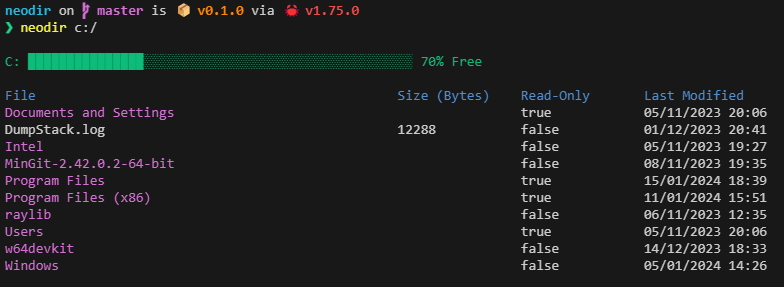

# neodir

neodir is a customised version of the `dir` command, tuned to my liking. The project is not complete yet, as I'm still experimenting with what features I personally would find useful in the program.

Neodir is written completely in Rust, currently only requiring the `chrono` crate.

## Build Instructions
As I am using a Cargo build system, all you have to do is run `cargo build`.

The program is being made for Windows and Linux, with no Mac build planned for the forseeable future.

## Features
<!--### General Features:-->
- Display files and folders for current directory
- Display files and folders for a directory, passed as a command-line argument
- Display file size in bytes
- Display last modified date for file and folder
- Display if the file or folder are read-only

### Windows Features:
- Display mounted drive capacity (C: only)
- Show hidden files with a command-line argument
- Shows the Windows [File Attribute](https://learn.microsoft.com/en-us/windows/win32/fileio/file-attribute-constants) value
- Ordered list, with directories coming before files
<!--
### Linux Features:
- 
-->

<!-- ## Planned Features -->